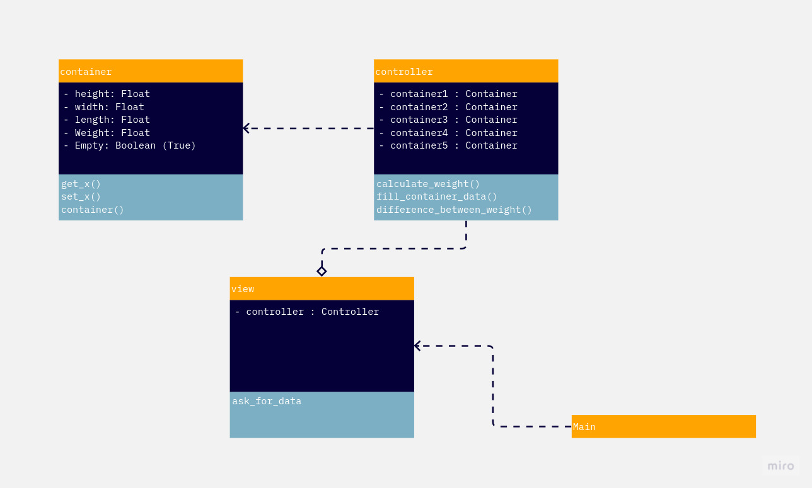

# Container Manager
## UML Diagram:

## How to use
Clone this repository
```
git clone https://github.com/juampam/container_manager
cd container_manager
```
The classes are already compiled so you can:
- Run the View class:
```
java container_manager.Vista
```
- If you want make changes and compile
```
javac container_manager/*.java
```
Please make sure that you are in the repository root directory when you run the commands
